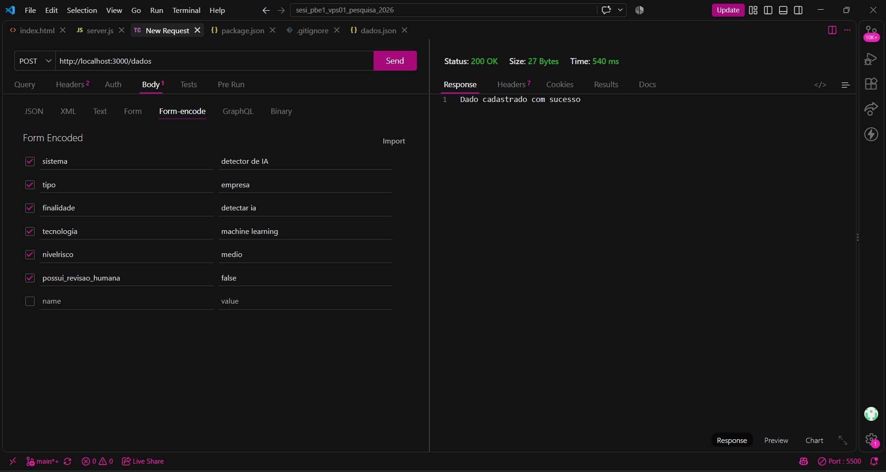
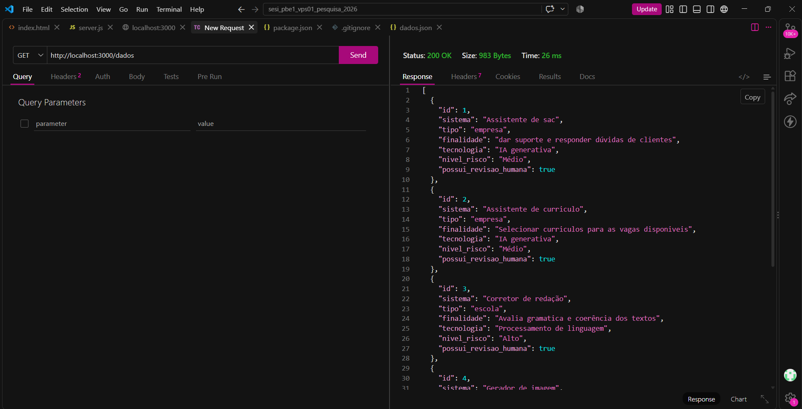
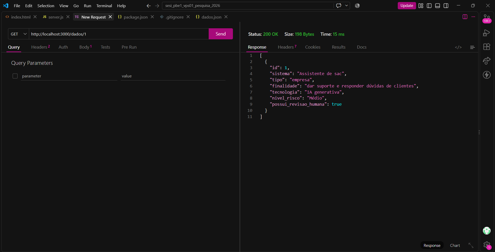
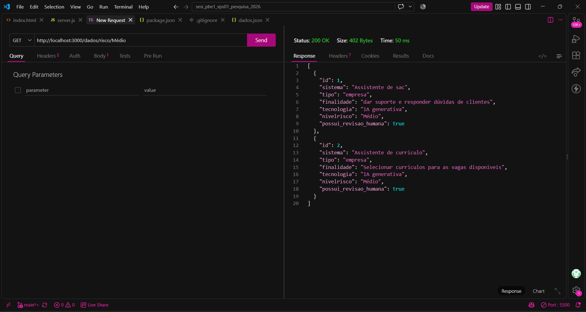
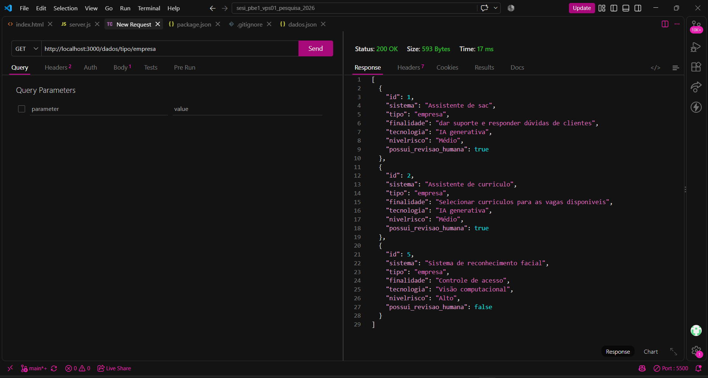
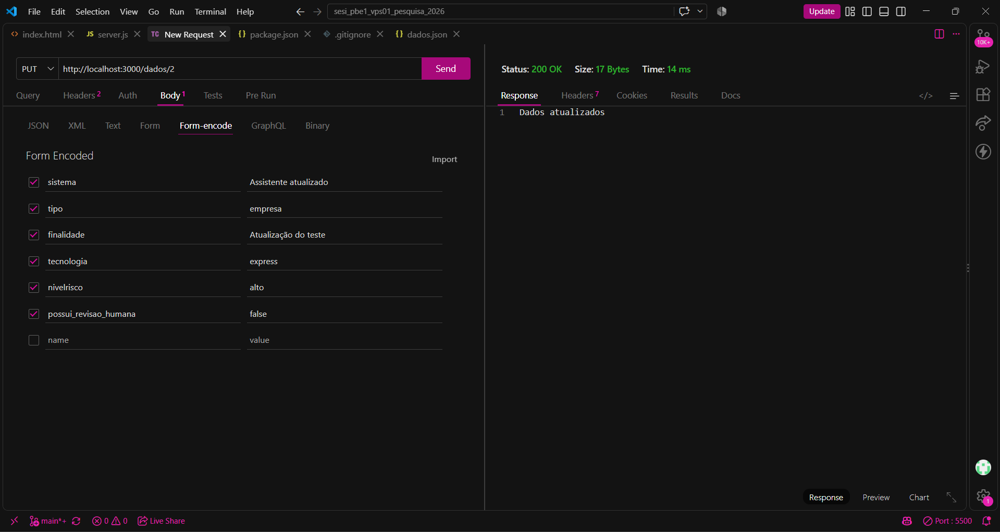
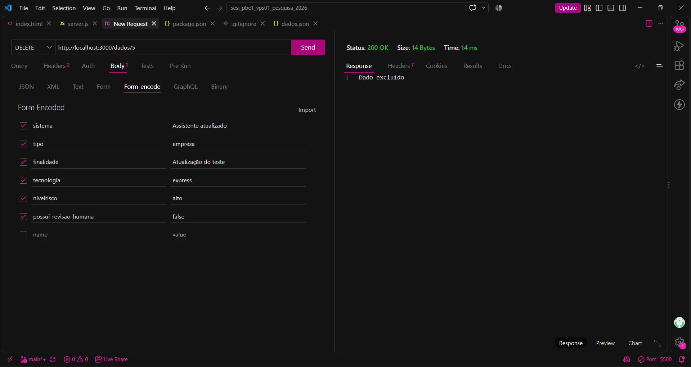
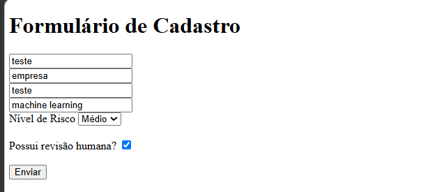
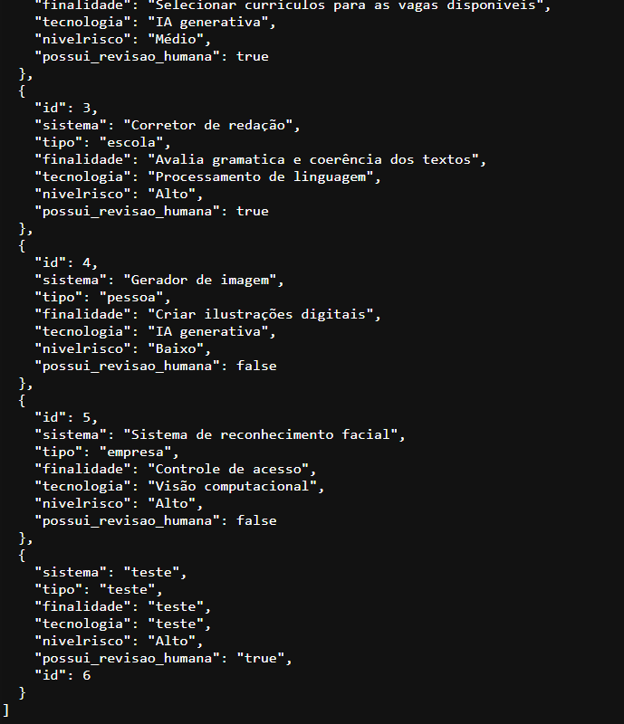

# Aula 07 - VPF01 - Pesquisa de campo

## tema
Back-end criado para um pesquisador da Faculdade de Jaguariuna, que precisa de um catálogo de usos de inteligência artificial por 
empresas, escolas ou pessoas, indicando a finalidade, a tecnologia empregada, o nível de risco envolvido e se existe revisão humana sobre as decisões do sistema. 

---

## Tecnologias
- **Node.js**
- **Express**
- **JavaScript**
- **VsCode**
- **Thunder Client**

---

## Passos para testar
- 1 Clone este repositório
- 2 Abra com VsCode e em um terminal digite:
```bash
npm install
npm run dev
```
- 3 Teste as rotas com a extensão `Thunder Client` do VsCode
- 4 Abra o arquivo client/index.html com a extensão `Live Server` do VsCode

---

## Print dos testes e exemplo de requisições

**Cadastrar um novo dado (POST `http://localhost:3000/dados`)**
```json
{
    "sistema": "Detector de IA",
    "tipo": "empresa",
    "finalidade": "Detectar IA",
    "tecnologia": "Machine learning",
    "nivelrisco": "Médio",
    "possui_revisao_humana": false
}
```


**Listar todos os dados (GET `http://localhost:3000/dados`)**


**Buscar por id (GET `http://localhost:3000/dados/1`)**


**Buscar por nível de risco (GET `http://localhost:3000/dados/risco/Médio`)**


**Buscar por tipo (GET `http://localhost:3000/dados/tipo/empresa`)**


**Atualizar um dado (PUT `http://localhost:3000/dados/2`)**


**Excluir um dado (DELETE `http://localhost:3000/dados/5`)**


---

## Print do formulário
- 
- Resposta:
- 
